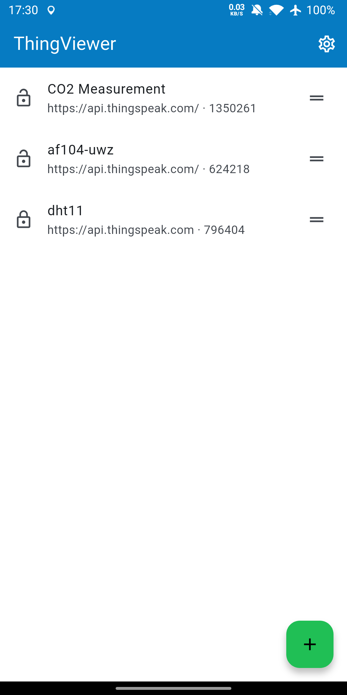
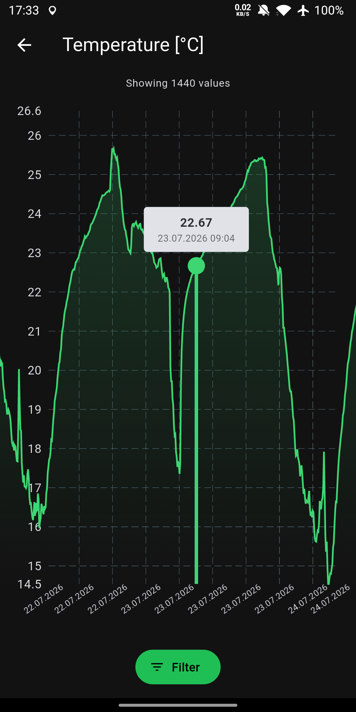
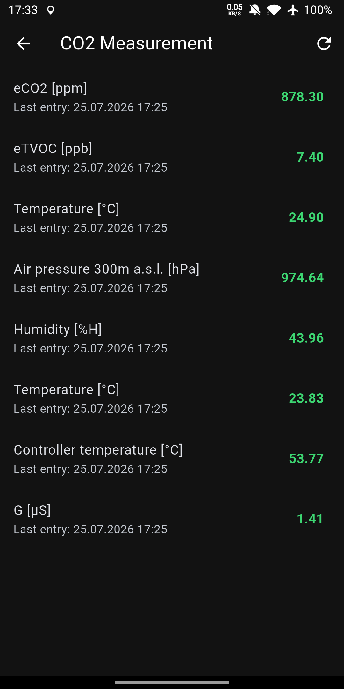

# ThingViewer

Mobile app for viewing and visualizing data from [ThingSpeak](https://thingspeak.com/) channels, built with Flutter.

[](https://github.com/janstol/ThingViewer/actions/workflows/ci.yml)
[](https://janstol.github.io/ThingViewer/)

<a href='https://play.google.com/store/apps/details?id=dev.stol.thingviewer'>

</a>

## Installation

Google Play is the recommended source and gets automatic updates.

Each [GitHub Release](https://github.com/janstol/ThingViewer/releases/latest) also includes signed APKs (arm64-v8a and armeabi-v7a), for installing without the Play Store, e.g. on de-Googled Android (CalyxOS, GrapheneOS). Works with [Obtainium](https://github.com/ImranR98/Obtainium) for auto-updates.

The GitHub APKs are signed with a different key than the Play Store version (Play re-signs apps with its own key), so switching between the two isn't an in-place update: uninstall the old one first, then use Settings → Backup to carry your saved channels and settings across.

## Screenshots

<p>



</p>

## Features

- Browse and manage multiple ThingSpeak channels, with a configurable start screen (channel list or a chosen channel's detail screen)
- View latest field values per channel, including its description and website/source links when set, with pull-to-refresh
- Visualize field data as line, spline, step, or column charts, with date and time range filtering
- Per-field chart settings: custom title, axis labels, Y-axis min/max, fixed decimal rounding, and a "show change between readings" mode for counters
- Automatically pages past ThingSpeak's per-request result cap so large date ranges aren't silently truncated; non-finite (`NaN`/`Infinity`) readings are skipped rather than breaking the chart
- Supports public and private (API key) channels
- Custom server URL (self-hosted ThingSpeak instances)
- Light / dark / system theme
- Configurable date and time formats, with an optional timezone indicator (offset or name)
- Export/import a full backup (saved channels, app settings, and per-field chart overrides) as a single JSON file
- Responsive layout — master-detail split on tablets

Android is the actively supported and tested target. Web is built and deployed to the [demo](https://janstol.github.io/ThingViewer/) on every push, but isn't covered by automated tests. Android and web are built on every pull request; iOS/macOS/Windows/Linux are build-checked weekly in CI, but aren't otherwise supported or tested.

## Development

### Requirements

- [mise](https://mise.jdx.dev/) — manages the Flutter version (`mise.toml` pins it)
- Flutter 3.47.0 / Dart 3.13.0

Commands below assume an activated mise shell (`mise activate` / `mise shell`). If mise isn't activated, prefix each command with `mise exec --`, e.g. `mise exec -- flutter test`.

### Setup

```bash
# Install Flutter via mise
mise install

# Install dependencies
flutter pub get

# Generate mocks (needed after changing @GenerateMocks annotations)
dart run build_runner build
```

### Running

```bash
flutter run
```

### Tests & analysis

```bash
flutter test
flutter analyze
```

### Release builds

Create `android/key.properties` with your keystore credentials:

```
storePassword=...
keyPassword=...
keyAlias=...
storeFile=path/to/keystore.jks
```

Then build:

```bash
flutter build apk          # Android APK
flutter build appbundle    # Android App Bundle (Play Store)
```

### Updating app icons

Edit `res/images/thingviewer_icon.png` (and `thingviewer_icon_foreground.png` for the adaptive foreground layer), then regenerate:

```bash
dart run flutter_launcher_icons
```

## Tech stack

| Concern | Library |
|---|---|
| HTTP | `http` |
| Local storage | `shared_preferences` |
| File picking | `file_picker` |
| Charts | `fl_chart` |
| Localisation | Flutter built-in ARB (`intl`) |
| App info | `package_info_plus` |
| URL handling | `url_launcher` |
| State management | `ChangeNotifier` + `ListenableBuilder` (built-in) |

## License

MIT
